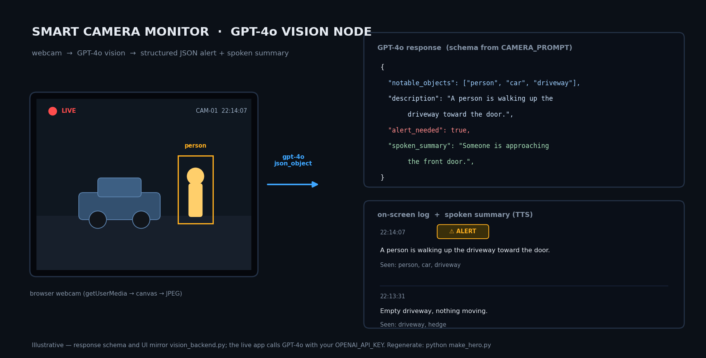

# GPT-4o Vision Node

A real-time computer vision pipeline that streams a mobile device's camera feed to a Python backend for analysis using OpenAI's GPT-4o vision model. 

This project demonstrates how to build an asynchronous, browser-based monitoring node without requiring a dedicated mobile application. The backend handles frame extraction and AI inference, returning a structured JSON response that the frontend uses to maintain a continuous event log and generate text-to-speech auditory alerts.



*Illustrative — the response schema and UI mirror `vision_backend.py`; the live app calls GPT-4o with your own `OPENAI_API_KEY`. Regenerate with `python make_hero.py`.*

## Features

* **Browser-Based Streaming:** Captures the device's rear-facing camera using HTML5 and standard web APIs.
* **Asynchronous Backend:** Built on FastAPI and Uvicorn for lightweight, non-blocking request handling.
* **High-Detail AI Inference:** Encodes frames to base64 and passes them to GPT-4o for contextual scene analysis, object detection, and threat assessment.
* **Auditory Feedback:** Utilizes the Web Speech API to read system summaries aloud in real-time.
* **Network Tunneling:** Uses Ngrok to establish a secure HTTPS connection, bypassing mobile browser restrictions on local network camera access.

## Response schema

Every analysis returns exactly this JSON (defined by `CAMERA_PROMPT` in `vision_backend.py`):

```json
{
  "notable_objects": ["person", "car", "driveway"],
  "description": "A person is walking up the driveway toward the door.",
  "alert_needed": true,
  "spoken_summary": "Someone is approaching the front door."
}
```

The UI prepends each result to a live log, shows an **⚠️ ALERT** badge when `alert_needed` is true, and speaks `spoken_summary` aloud.

## Tech Stack

* **Language:** Python 3.x, JavaScript (ES6), HTML/CSS
* **Backend Framework:** FastAPI, Uvicorn, Pydantic
* **AI/ML:** OpenAI Python SDK (gpt-4o)
* **Environment Management:** python-dotenv

## Prerequisites

To run this project locally, you will need:
* Python 3.8 or higher installed.
* An active OpenAI API key.
* A free [Ngrok](https://ngrok.com/) account for tunneling.

## Installation

1. **Clone the repository:**
   ```bash
   git clone https://github.com/MichaelFowler1/gpt4o-vision-node.git
   cd gpt4o-vision-node
   ```

2. **Set up a virtual environment (recommended):**
   ```bash
   python -m venv .venv
   .venv\Scripts\activate  # On Windows
   # source .venv/bin/activate  # On Mac/Linux
   ```

3. **Install dependencies:**
   ```bash
   pip install -r requirements.txt
   ```

4. **Configure environment variables:**
   Create a file named `.env` in the root directory and add your OpenAI API key:
   ```env
   OPENAI_API_KEY=sk-your-actual-api-key-here
   ```

   *(Ensure `.env` is listed in your `.gitignore` file to prevent exposing your credentials).*

## Usage

Running the application requires two terminal windows: one for the local Python server and one for the network tunnel.

**1. Start the Backend Server**
In your first terminal (with the virtual environment activated), start the FastAPI application:

```bash
uvicorn vision_backend:app --host 0.0.0.0 --port 8000
```

**2. Initialize the Secure Tunnel**
In a second terminal, open an HTTPS tunnel to the local server port:

```bash
ngrok http 8000
```

**3. Connect the Node**

* Note the `https://[random-string].ngrok-free.app` URL provided in the Ngrok terminal.
* Open this URL in a mobile browser (Safari or Chrome).
* Grant the requested camera permissions and click "Start Monitoring" to begin the analysis loop.

## Notes & limitations

* **Cost:** every frame is a GPT-4o vision call (`detail: high`) on a ~4 s loop. Watch your usage; raise the interval in `analyzeFrame()` to reduce spend.
* **CORS is wide open** (`allow_origins=["*"]`) — fine for local/demo use; lock it down before exposing the endpoint.
* **No persistence:** the log lives in the browser tab only; frames are processed in memory and not stored server-side.
